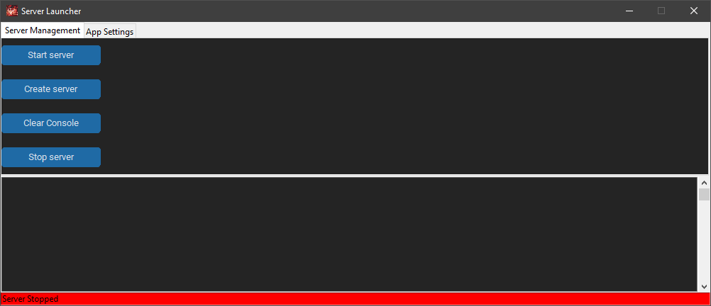
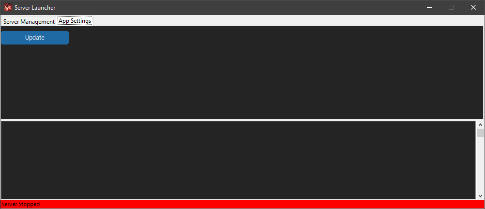

# Puzzix ServerLauncher
A simple easy to use Mnecraft java server launcher

# Installation
To use Serverlauncher, you need to have [Python 3](https://www.python.org/downloads/) installed on your system. You can download the latest version of Python from [here](https://www.python.org/downloads/).

Once you have Python installed, you can go to the relases and download the lastest version.

# Usage
App: In the app u can chose to start,stop,create, and clear console.

Discord: You can use slash command to manage the server ex(start,stop,ip,create).

# Configuration
You can customize various settings of the Minecraft server by modifying the server.properties file, which is located in the directory you chose to download the files in the config.ini. You can also modify the eula.txt file to accept the Minecraft End User License Agreement (EULA).

# Preview

# License
Serverlauncher is released under the MIT License. See [License](LICENSE) for more information.

# Contributing
If you would like to contribute to Serverlauncher, feel free to submit a pull request. However, please ensure that your code adheres to the <a href="https://www.python.org/dev/peps/pep-0008/" onclick="window.open(this.href,'_blank');return false;">PEP 8 Style Guide</a>
 and includes appropriate unit tests.
